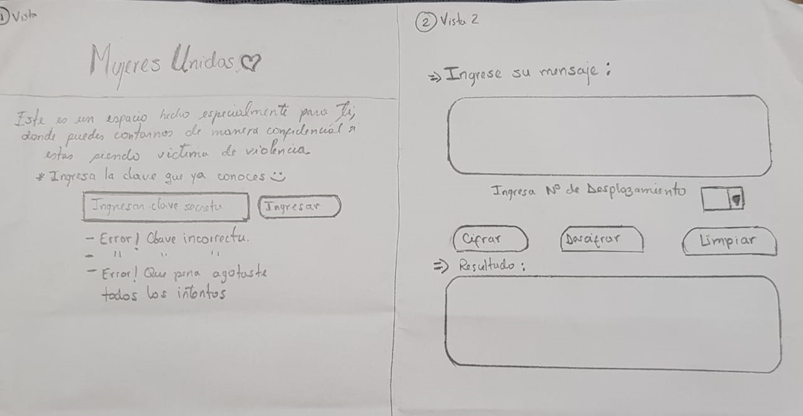
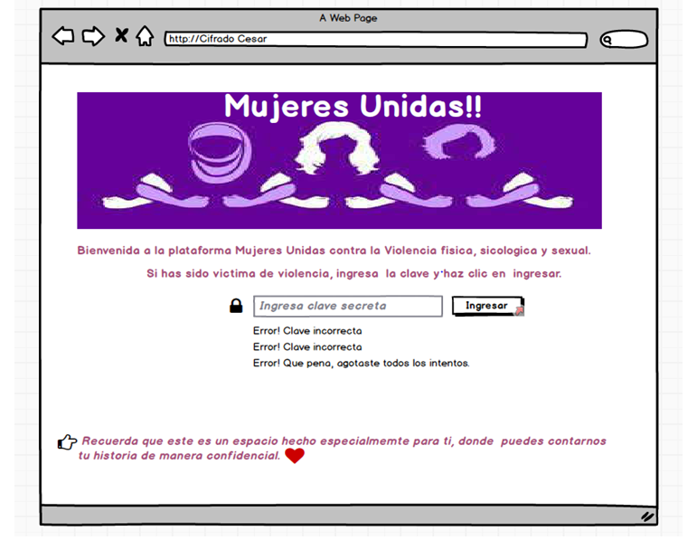
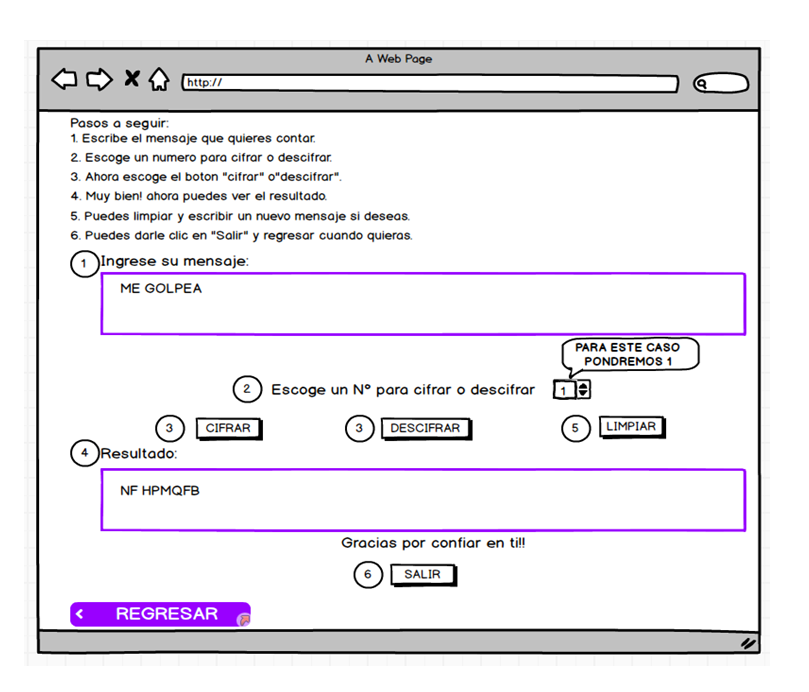

#Mujeres Unidas

Mujeres Unidas es una plataforma que da acompañamiento a mujeres víctimas de violencia física, psicológica y sexual.

##Investigación UX:

###Usuarios: 

Mujeres de todas las edades, víctimas de violencia.

###Objetivo:

Ser una alternativa para mujeres víctimas de violencia, que quizás por su situación social o profesional, no se atreven en un primer momento a denunciar un hecho de violencia  a una comisaría, pero que puede que sí se atrevan a utilizar esta plataforma virtual.

###Solución al problema: 

Dar acompañamiento virtual a la víctima, para que sepa cuál es el delito que se ha cometido contra ella y explicarle el procedimiento para presentar una denuncia si así lo desea, así como informarle de los servicios a los que se puede acoger y facilitarle también acompañamiento psicológico si lo requiere.

###Prototipo en papel:

###Resumen del feedback: 

Me recomendaron explicar mejor las instrucciones, y opte por hacer un ejemplo.
Agregar en las instrucciones que el usuario debe escribir en mayuscula

###Imagen del prototipo final en Balsamiq:


