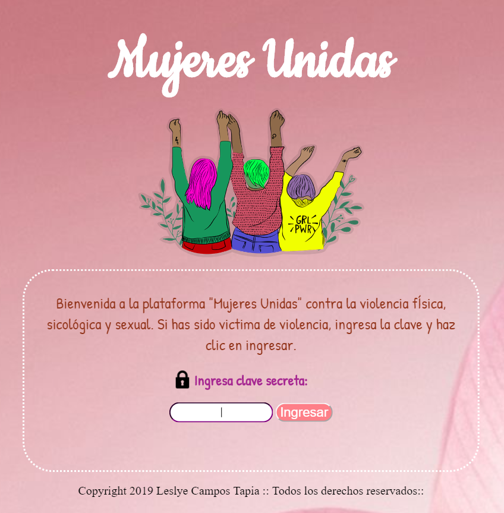
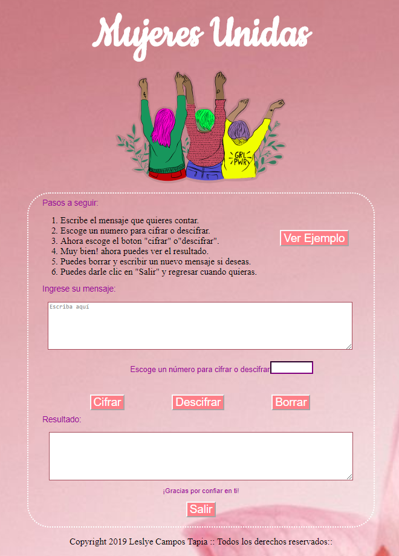
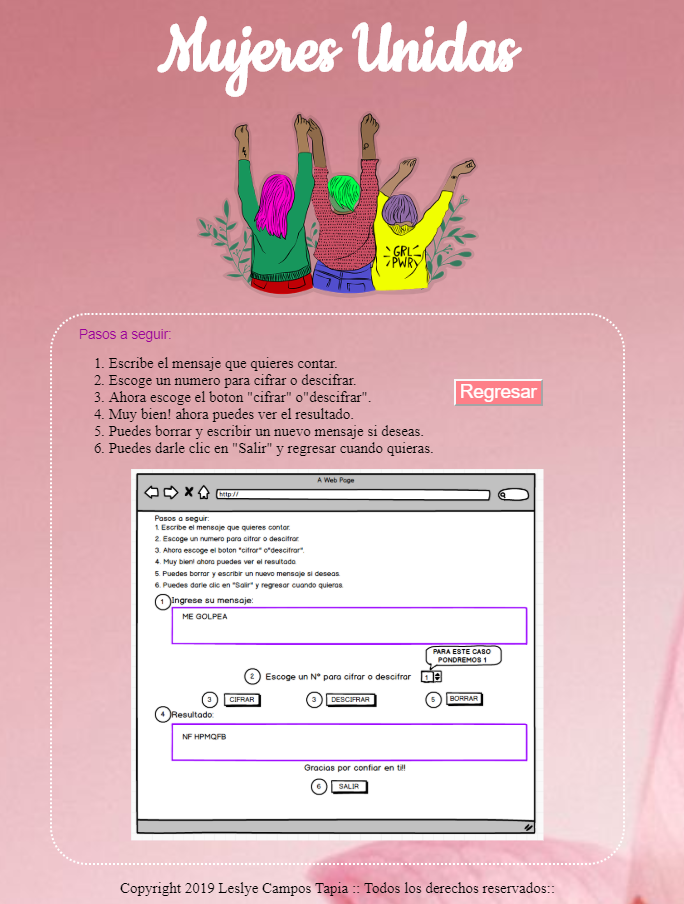
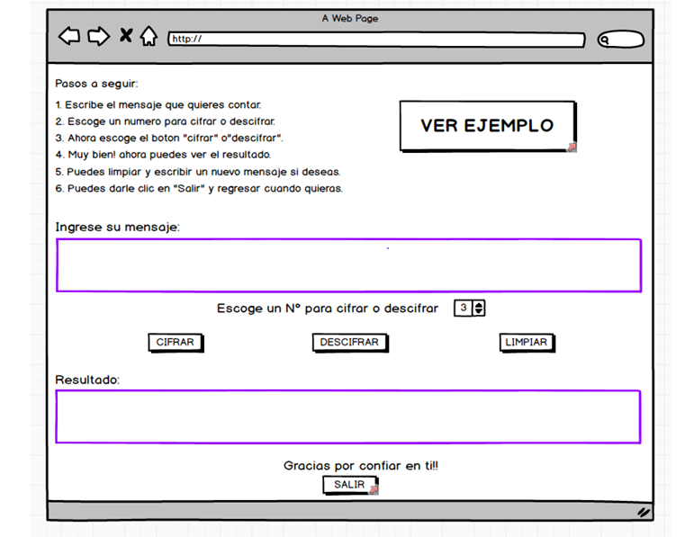
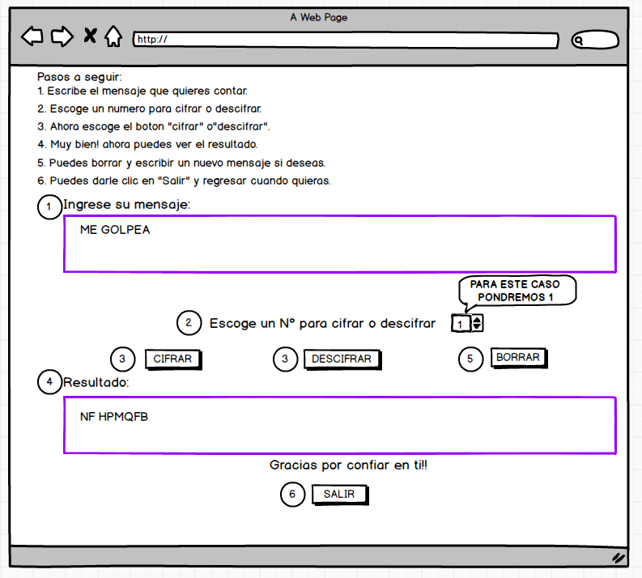

## Mujeres Unidas 
Mujeres Unidas es una plataforma que da acompañamiento a mujeres víctimas de violencia física, psicológica y sexual.

### Imagen final del proyecto

## Investigación UX:

### Usuarios: 
- Mujeres de todas las edades, víctimas de violencia.

### Objetivo:
- Ser una alternativa para mujeres víctimas de violencia, que quizás por su situación social o profesional, no se atreven en un primer momento a denunciar un hecho de violencia  a una comisaría, pero que puede que sí se atrevan a utilizar esta plataforma virtual.
<<<<<<< HEAD

### Solución al problema: 

- Dar acompañamiento virtual a la víctima, para que sepa cuál es el delito que se ha cometido contra ella y explicarle el procedimiento para presentar una denuncia si así lo desea, así como informarle de los servicios a los que se puede acoger y facilitarle también acompañamiento psicológico si lo requiere.

### Prototipo en papel:

### Resumen del feedback: 

- Me recomendaron explicar mejor las instrucciones y opte por hacer un ejemplo.
- Hacer boton ejemplo que llame a una imagen donde explica de que forma funciona el cifrado Cesar.
- Mejorar los colores y las imagenes.
- Mejorar el tipo de letra.
- Poner iconos.
- Mejorar los terminos descriptivos.
- Ceñirme al balsamiq.

### Imagen del prototipo final en Balsamiq:


